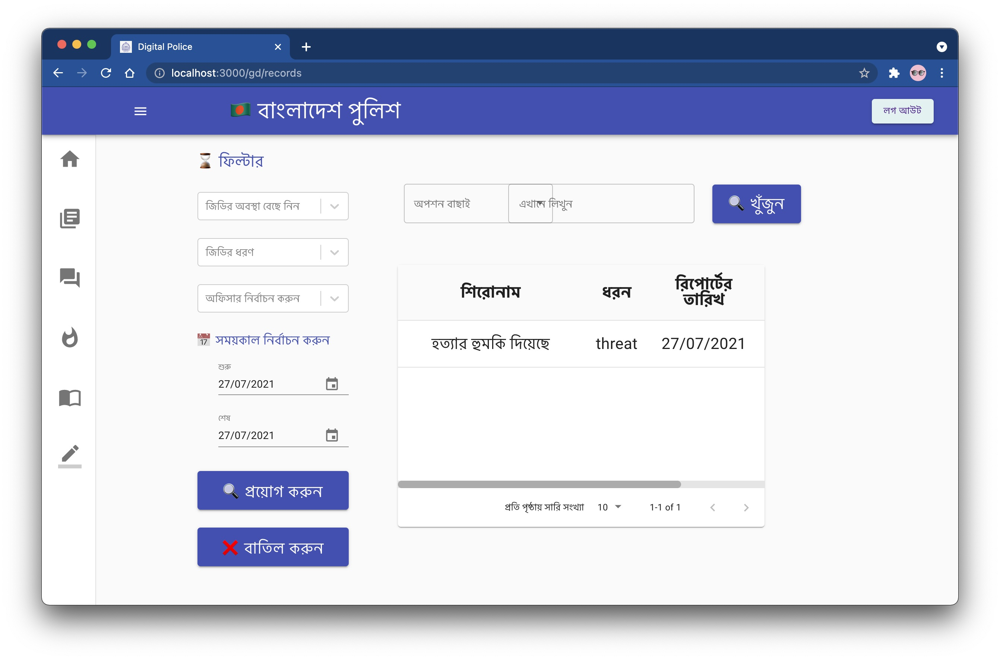
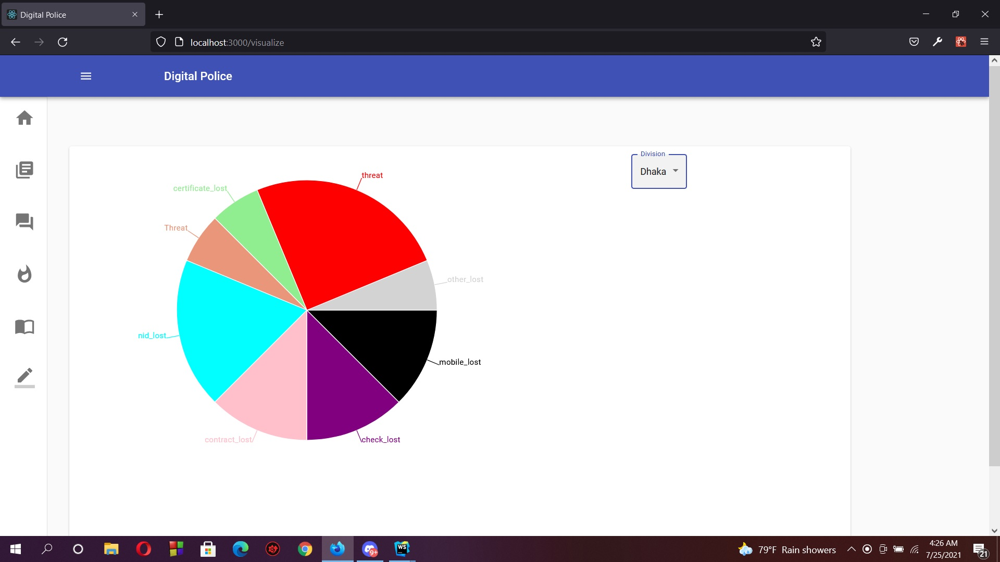
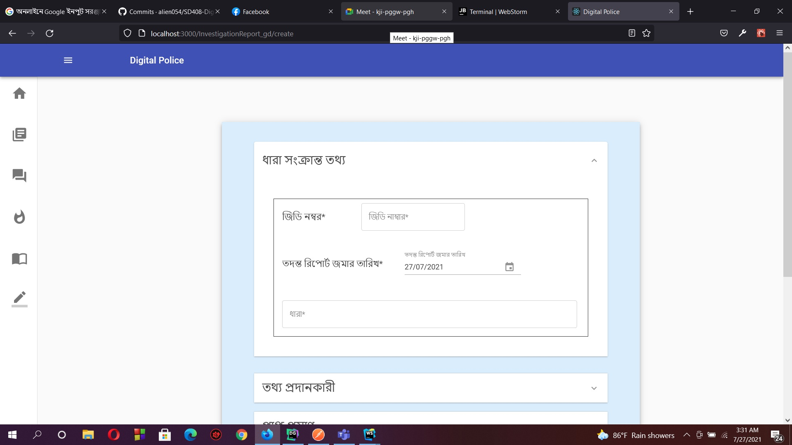

## Aim
The basic idea of this project is to maintain a police department and all of its work related to crime investigation. 
This ranges from basic HR management work like maintaining database of all the police as well as criminals and crime reports to active scheduling of all the police officers.
This will be helpful in digitizing the existing police department record keeping.

## Components

1.  GD, FIR (Role: Officer)
Scan Copy of original document
Digital copy of original report
Final DB entry 
2.  Monitoring ongoing cases (Role: Officer)
Updated by assigned officers
Reviewed by superior officers
New evidence, new info etc. recorded 
Creating new cases
Final report by assigned officers
3.  Task assignment (Role: OC)
Daily task assignment
Creating new task
Updating task
Case assignment

4.  Task( Role: officers)
accepting/ rejecting task
Show reason for rejecting 
Report when task is finished(file upload)
If task is related to a case then it may be added to task

5. Helpline
Respond to helpline
Respond to backup call

6. Emergency 
Respond to an emergency
Sit Rep
Call for backup if needed

Pubic End
login/signup
Chat
Emergency report(file upload)

Basic functionalities
Case record
Officer’s db
Criminal db
Evidence record 
Analytics ( later version)

## UML Diagram

## Screenshots

